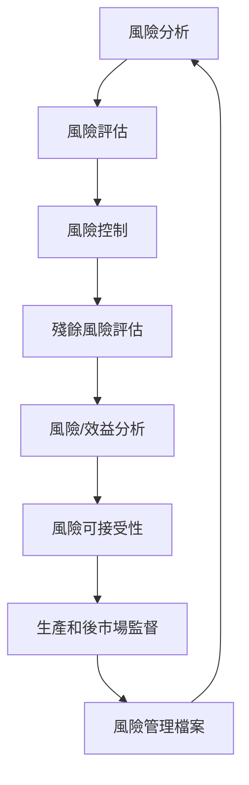

# 風險管理計畫
## ARC-HBR 出血風險計算器 SMART on FHIR 應用程式

**文件版本**: 1.0  
**文件日期**: 2024年1月  
**符合標準**: ISO 14971:2019, IEC 62304:2006+A1:2015  
**核准日期**: _______________

---

## 1. 執行摘要

### 1.1 目的與範圍
本風險管理計畫建立了 ARC-HBR 出血風險計算器軟體的系統性風險管理流程，確保在整個產品生命週期中識別、評估、控制和監控風險。

### 1.2 產品資訊
- **產品名稱**: ARC-HBR 出血風險計算器
- **產品代碼**: ARCBR-SMART-001
- **軟體版本**: 1.0
- **預期用途**: 臨床決策支援 - 評估患者出血風險
- **目標市場**: 美國醫療機構
- **法規分類**: FDA Class II 軟體醫療器材

### 1.3 法規要求
- ISO 14971:2019 - 醫療器材風險管理
- IEC 62304:2006+A1:2015 - 醫療器材軟體
- FDA 21 CFR Part 820 - 品質系統規範
- HIPAA 安全規則
- 45 CFR Part 46 - 人體試驗保護

---

## 2. 風險管理組織架構

### 2.1 風險管理團隊
| 角色 | 責任 | 負責人 |
|------|------|--------|
| **風險管理負責人** | 整體風險管理計畫執行與監督 | [姓名] |
| **品質保證經理** | 風險控制措施驗證與品質審查 | [姓名] |
| **臨床事務主管** | 臨床風險評估與驗證 | [姓名] |
| **軟體架構師** | 技術風險評估與控制設計 | [姓名] |
| **法規事務專員** | 法規合規性確保 | [姓名] |
| **資訊安全專員** | 網路安全風險管理 | [姓名] |

### 2.2 權責分工
- **風險識別**: 全體團隊成員
- **風險評估**: 風險管理負責人 + 相關專業人員
- **風險控制**: 軟體開發團隊
- **風險監控**: 品質保證部門
- **風險溝通**: 風險管理負責人

---

## 3. 風險管理流程

### 3.1 風險管理生命週期

### 3.2 風險管理活動時程表

| 階段 | 活動 | 時程 | 負責人 |
|------|------|------|--------|
| **設計階段** | 初始風險分析 | 設計開始後 2 週 | 風險管理團隊 |
| | 風險控制措施設計 | 設計期間持續 | 軟體架構師 |
| **開發階段** | 風險控制實施 | 開發期間持續 | 開發團隊 |
| | 風險控制驗證 | 每個里程碑 | 品質保證 |
| **測試階段** | 殘餘風險評估 | 測試完成後 | 風險管理團隊 |
| | 風險效益分析 | 上市前 1 個月 | 風險管理負責人 |
| **上市後** | 後市場監督 | 持續進行 | 品質保證 |
| **維護期** | 定期風險審查 | 每季度 | 風險管理團隊 |

---

## 4. 風險評估標準

### 4.1 嚴重程度分級

| 等級 | 分類 | 定義 | 範例 |
|------|------|------|------|
| **5** | 災難性 | 死亡 | 錯誤建議導致致命出血 |
| **4** | 重大 | 永久傷害或重大健康影響 | 長期器官損傷 |
| **3** | 中等 | 暫時傷害或需要醫療干預 | 需要額外治療的出血 |
| **2** | 輕微 | 輕微不適或延誤 | 輕微的工作流程中斷 |
| **1** | 可忽略 | 無傷害 | 系統響應稍慢 |

### 4.2 發生機率評估

| 等級 | 分類 | 機率範圍 | 定義 |
|------|------|----------|------|
| **5** | 頻繁 | >10⁻³ | 預期在正常使用中會發生 |
| **4** | 可能 | 10⁻³ - 10⁻⁴ | 可能在產品生命週期中發生 |
| **3** | 偶然 | 10⁻⁴ - 10⁻⁵ | 偶爾可能發生 |
| **2** | 罕見 | 10⁻⁵ - 10⁻⁶ | 不太可能但可能發生 |
| **1** | 極罕見 | <10⁻⁶ | 幾乎不可能發生 |

### 4.3 風險可接受性矩陣

| 嚴重程度\機率 | 1 | 2 | 3 | 4 | 5 |
|---------------|---|---|---|---|---|
| **5** | 🟡 | 🔴 | 🔴 | 🔴 | 🔴 |
| **4** | 🟢 | 🟡 | 🔴 | 🔴 | 🔴 |
| **3** | 🟢 | 🟢 | 🟡 | 🟡 | 🔴 |
| **2** | 🟢 | 🟢 | 🟢 | 🟡 | 🟡 |
| **1** | 🟢 | 🟢 | 🟢 | 🟢 | 🟡 |

**圖例**: 🟢 可接受 | 🟡 需要 ALARP 分析 | 🔴 不可接受

---

## 5. 風險控制策略

### 5.1 風險控制層次
根據 ISO 14971，按優先順序實施：

1. **本質安全設計** (Inherent Safety)
   - 安全的軟體架構設計
   - 防錯設計原則
   - 最小權限原則

2. **保護措施** (Protective Measures)
   - 輸入驗證和清理
   - 錯誤檢測和恢復
   - 加密和認證

3. **使用資訊** (Information for Safety)
   - 使用者培訓
   - 警告和標籤
   - 使用手冊

### 5.2 風險控制措施類別

#### 5.2.1 軟體設計控制
- **資料驗證**: 所有輸入資料的完整性檢查
- **演算法驗證**: 與已發表研究的對照驗證
- **錯誤處理**: 優雅的錯誤處理和用戶通知
- **冗餘檢查**: 關鍵計算的獨立驗證

#### 5.2.2 安全控制
- **認證和授權**: OAuth 2.0 / SMART on FHIR
- **資料加密**: 傳輸和靜態資料加密
- **存取控制**: 角色基礎的存取控制
- **稽核追蹤**: 完整的操作日誌記錄

#### 5.2.3 品質控制
- **測試策略**: 單元、整合、系統、使用者驗收測試
- **程式碼審查**: 同儕審查和靜態分析
- **配置管理**: 版本控制和變更管理
- **文件控制**: 技術文件的版本管理

---

## 6. 風險監控和審查

### 6.1 持續監控指標

#### 6.1.1 技術指標
- **系統可用性**: 目標 ≥ 99.9%
- **響應時間**: 平均 < 3 秒
- **錯誤率**: < 0.1% 的計算錯誤
- **安全事件**: 零重大安全漏洞

#### 6.1.2 臨床指標
- **使用者滿意度**: 目標 ≥ 4.0/5.0
- **臨床相關性**: 與專家評估的一致性 ≥ 95%
- **工作流程影響**: 診斷時間減少 ≥ 20%

#### 6.1.3 合規指標
- **法規符合性**: 100% 法規要求符合
- **隱私保護**: 零 HIPAA 違規事件
- **文件完整性**: 100% 必要文件更新

### 6.2 風險審查排程

| 審查類型 | 頻率 | 觸發條件 | 參與者 |
|----------|------|----------|--------|
| **定期審查** | 每季度 | 日曆排程 | 風險管理團隊 |
| **里程碑審查** | 每個開發里程碑 | 開發進度 | 全體項目團隊 |
| **事件觸發審查** | 即時 | 重大事件或變更 | 相關專家 |
| **年度全面審查** | 每年 | 年度排程 | 所有利害關係人 |

---

## 7. 後市場監督

### 7.1 監督活動

#### 7.1.1 主動監督
- **使用者回饋收集**
  - 線上回饋表單
  - 定期使用者調查
  - 客戶支援票據分析

- **系統監控**
  - 24/7 系統監控
  - 效能指標追蹤
  - 錯誤報告自動收集

- **文獻監控**
  - 相關醫學文獻追蹤
  - 同類產品安全報告監控
  - 法規更新監控

#### 7.1.2 被動監督
- **不良事件報告系統**
- **客戶投訴處理流程**
- **法規機關通報機制**

### 7.2 回應機制

| 事件嚴重程度 | 回應時間 | 行動要求 | 通報要求 |
|-------------|----------|----------|----------|
| **緊急** | 2 小時內 | 立即停用/修復 | 立即通報法規機關 |
| **高** | 24 小時內 | 緊急修復計畫 | 3 天內通報 |
| **中** | 72 小時內 | 修復排程 | 10 天內通報 |
| **低** | 1 週內 | 計畫性修復 | 季度報告 |

---

## 8. 風險溝通

### 8.1 內部溝通

#### 8.1.1 定期報告
- **週報**: 開發期間的風險狀態
- **月報**: 管理層風險摘要
- **季報**: 董事會風險報告

#### 8.1.2 關鍵溝通
- **風險警報**: 新發現的高風險
- **變更通知**: 風險狀態重大變更
- **里程碑報告**: 項目階段風險評估

### 8.2 外部溝通

#### 8.2.1 法規機關
- **註冊申請**: 風險管理文件提交
- **定期報告**: 法規要求的風險報告
- **事件通報**: 嚴重不良事件報告

#### 8.2.2 使用者和客戶
- **安全通訊**: 安全相關更新通知
- **使用指引**: 安全使用說明
- **培訓材料**: 風險認知教育

---

## 9. 資源和培訓

### 9.1 人力資源配置

| 角色 | 時間投入 (%) | 必要資格 |
|------|-------------|----------|
| 風險管理負責人 | 100% | 風險管理認證、醫療器材經驗 |
| 品質保證經理 | 50% | 品質管理認證 |
| 臨床專家 | 25% | 醫學學位、臨床經驗 |
| 軟體架構師 | 30% | 軟體工程背景、醫療軟體經驗 |

### 9.2 培訓計畫

#### 9.2.1 基礎培訓
- **風險管理原理** (8 小時)
- **ISO 14971 標準** (16 小時)
- **IEC 62304 軟體要求** (12 小時)
- **法規要求概述** (8 小時)

#### 9.2.2 專業培訓
- **臨床風險評估** (24 小時) - 醫療人員
- **軟體安全設計** (32 小時) - 技術人員
- **網路安全風險** (16 小時) - IT 人員

#### 9.2.3 持續教育
- **年度風險管理更新** (4 小時)
- **新法規要求培訓** (依需要)
- **行業最佳實踐研討會** (16 小時/年)

---

## 10. 風險管理記錄

### 10.1 文件管理

#### 10.1.1 必要記錄
- 風險分析報告
- 風險評估工作表
- 風險控制驗證報告
- 殘餘風險評估
- 風險效益分析
- 後市場監督報告

#### 10.1.2 記錄保存
- **保存期限**: 產品生命週期 + 7 年
- **存儲位置**: 安全的電子文件管理系統
- **備份策略**: 異地備份，每日同步
- **存取控制**: 角色基礎的存取權限

### 10.2 追溯性要求
- 所有風險決策的可追溯性
- 風險控制措施的實施證據
- 驗證和確認活動記錄
- 變更控制記錄

---

## 11. 持續改善

### 11.1 改善機會識別
- 風險管理流程效率分析
- 新興風險識別方法
- 行業最佳實踐採納
- 法規要求更新適應

### 11.2 改善實施
- 季度改善建議收集
- 年度風險管理流程審查
- 持續專業發展計畫
- 技術和方法創新採用

---

## 12. 附錄

### 附錄 A: 風險評估工作表範本
### 附錄 B: 風險控制驗證檢查清單
### 附錄 C: 不良事件報告表單
### 附錄 D: 法規要求對照表
### 附錄 E: 緊急應變程序
### 附錄 F: 培訓記錄範本

---

## 文件核准

| 角色 | 姓名 | 簽名 | 日期 |
|------|------|------|------|
| **風險管理負責人** | _____________ | _____________ | _______ |
| **品質保證經理** | _____________ | _____________ | _______ |
| **臨床事務主管** | _____________ | _____________ | _______ |
| **法規事務主管** | _____________ | _____________ | _______ |
| **項目經理** | _____________ | _____________ | _______ |

**下次審查日期**: 2024年7月31日

---

*此文件符合 ISO 14971:2019 和 IEC 62304:2006+A1:2015 要求，並根據 FDA 軟體醫療器材指引制定。* 