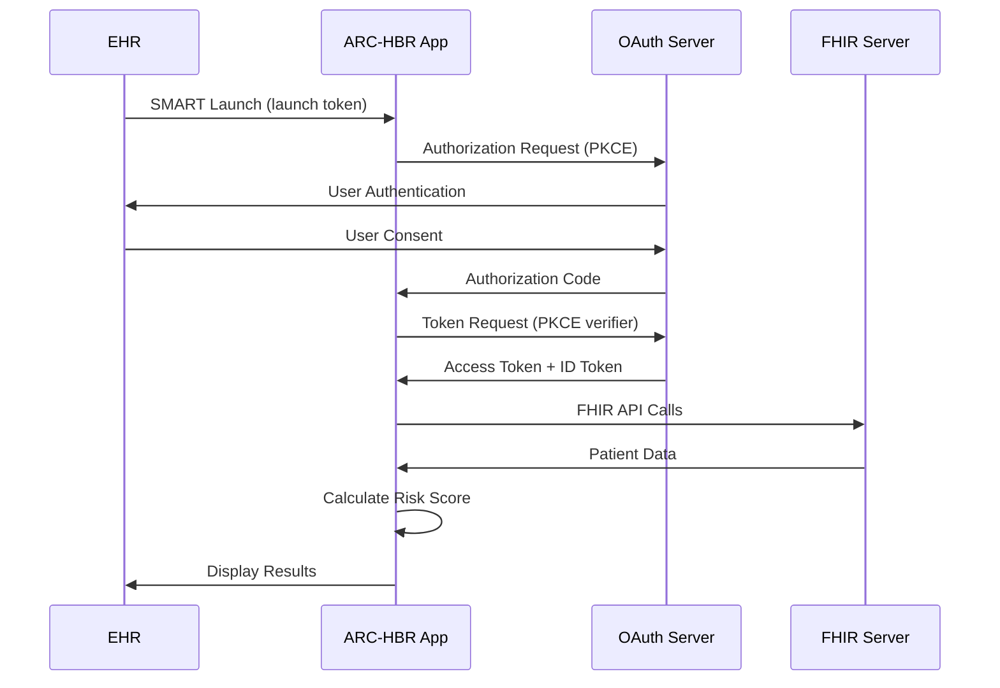
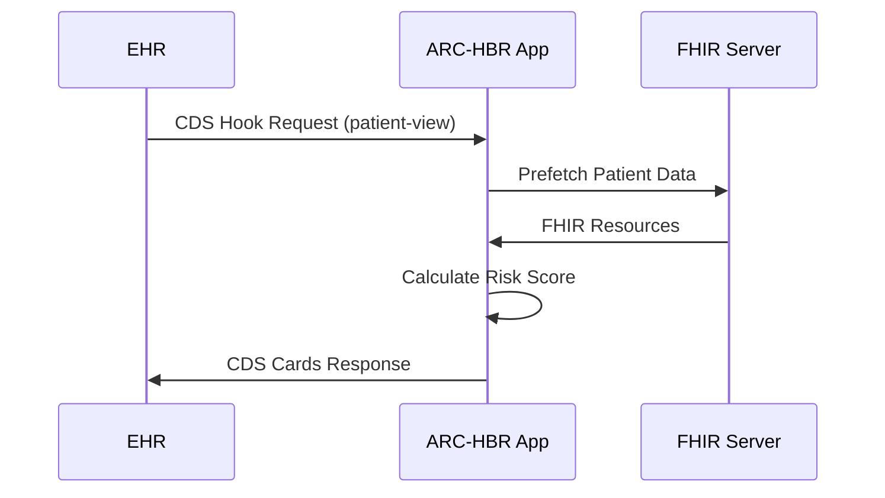

# 軟體需求規格書 (Software Requirements Specification)
## ARC-HBR 出血風險計算器 SMART on FHIR 應用程式

**文件版本**: 1.0  
**文件日期**: 2024年1月31日  
**符合標準**: IEC 62304:2006+A1:2015, ISO 14971:2019, FDA 軟體醫療器材指引  
**核准狀態**: 草稿  

---

## 📋 文件資訊

| 項目 | 詳細資訊 |
|------|----------|
| **產品名稱** | ARC-HBR 出血風險計算器 SMART on FHIR 應用程式 |
| **產品代碼** | ARCBR-SMART-001 |
| **版本** | 1.0 |
| **法規分類** | FDA Class II 軟體醫療器材 |
| **安全分類** | IEC 62304 Class B (非致命傷害) |
| **文件編號** | SRS-001 |

### 文件修訂歷史

| 版本 | 日期 | 修訂者 | 修訂內容 |
|------|------|--------|----------|
| 1.0 | 2024-01-31 | 系統分析師 | 初始版本 |

---

## 1. 引言

### 1.1 目的

本文件定義 ARC-HBR 出血風險計算器 SMART on FHIR 應用程式的軟體需求，包括功能需求、效能需求、介面需求及約束條件。此文件作為軟體開發、測試、驗證的基礎依據。

### 1.2 範圍

#### 包含範圍
- SMART on FHIR 標準應用程式
- ARC-HBR (Academic Research Consortium for High Bleeding Risk) 評分演算法
- FHIR R4 資源整合 (Patient, Observation, Condition, MedicationRequest, Procedure)
- CDS Hooks 服務整合
- OAuth 2.0 + PKCE 認證
- 臨床決策支援介面

#### 排除範圍
- EHR 系統本身的功能
- FHIR 伺服器實作
- 患者資料儲存
- 計費或行政管理功能

### 1.3 預期用途

#### 1.3.1 醫療用途聲明
本軟體用於協助醫療專業人員評估患者的出血風險，特別是在考慮抗凝血治療時提供決策支援。

#### 1.3.2 適用對象
- **主要使用者**: 心臟科醫師、內科醫師
- **次要使用者**: 護理師、藥師、住院醫師
- **管理員**: IT 管理人員、系統管理員

#### 1.3.3 臨床環境
- 醫院門診部
- 住院病房
- 急診科
- 心導管室

### 1.4 法規和標準合規性

| 標準/法規 | 適用章節 | 合規狀態 |
|----------|----------|----------|
| **IEC 62304:2006+A1:2015** | 軟體生命週期流程 | ✅ 部分合規 |
| **ISO 14971:2019** | 風險管理 | ✅ 部分合規 |
| **FDA 21 CFR Part 820** | 品質系統 | 🔄 進行中 |
| **HIPAA 安全規則** | 資料安全與隱私 | ✅ 基本合規 |
| **SMART on FHIR v1.0** | 互操作性標準 | ✅ 合規 |
| **CDS Hooks v1.0** | 臨床決策支援 | ✅ 合規 |

---

## 2. 整體描述

### 2.1 產品概述

ARC-HBR 出血風險計算器是一個基於 SMART on FHIR 標準的臨床決策支援工具，整合於醫院資訊系統 (如 Cerner, Epic) 中，自動計算患者的出血風險評分。

#### 2.1.1 核心功能
1. **風險評分計算**: 基於 ARC-HBR 2019 共識標準
2. **FHIR 資料整合**: 自動擷取患者臨床資料
3. **即時決策支援**: 提供實時風險評估和建議
4. **多重整合模式**: 支援 SMART Launch 和 CDS Hooks

#### 2.1.2 技術架構
```
┌─────────────────────────────────────────────────────────────┐
│                    EHR 系統 (Cerner/Epic)                    │
├─────────────────────────────────────────────────────────────┤
│  SMART on FHIR Launch │  CDS Hooks Integration │  FHIR API   │
├─────────────────────────────────────────────────────────────┤
│               ARC-HBR 出血風險計算器應用程式                  │
│  ┌─────────────┐  ┌─────────────┐  ┌─────────────┐          │
│  │ 認證模組     │  │ 風險計算引擎 │  │ FHIR 整合    │          │
│  │ OAuth 2.0   │  │ ARC-HBR     │  │ R4 Resources │          │
│  │ + PKCE      │  │ Algorithm   │  │ Integration  │          │
│  └─────────────┘  └─────────────┘  └─────────────┘          │
│  ┌─────────────┐  ┌─────────────┐  ┌─────────────┐          │
│  │ 使用者介面   │  │ CDS Hook    │  │ 安全控制     │          │
│  │ HTML/JS     │  │ Service     │  │ HTTPS/CSP   │          │
│  └─────────────┘  └─────────────┘  └─────────────┘          │
└─────────────────────────────────────────────────────────────┘
```

### 2.2 使用者角色和權限

#### 2.2.1 醫療專業人員
- **權限**: 查看患者資料、執行風險評估、查看評估結果
- **限制**: 不能修改演算法參數、不能存取其他患者資料

#### 2.2.2 系統管理員
- **權限**: 系統配置、使用者管理、稽核日誌查看
- **限制**: 不能直接存取患者醫療資料

#### 2.2.3 IT 管理員
- **權限**: 技術配置、伺服器維護、備份還原
- **限制**: 不能存取患者醫療資料

### 2.3 運作環境

#### 2.3.1 技術環境
- **作業系統**: Linux (CentOS 7+, Ubuntu 18.04+), Windows Server 2016+
- **Python 版本**: Python 3.8+
- **Web 框架**: Flask 2.0+
- **資料庫**: Redis (快取), PostgreSQL (日誌)
- **Web 伺服器**: Nginx, Apache
- **容器化**: Docker 支援

#### 2.3.2 網路需求
- **HTTPS**: 必須，TLS 1.2+
- **頻寬**: 最小 1 Mbps，建議 10 Mbps+
- **延遲**: <500ms 到 FHIR 伺服器
- **可用性**: 99.9% 正常運行時間

---

## 3. 系統需求

### 3.1 功能需求

#### FR-001: SMART on FHIR 啟動
**描述**: 支援標準 SMART on FHIR 啟動流程
**優先級**: 高
**驗收標準**:
- [ ] 支援 EHR Launch 和 Standalone Launch
- [ ] 正確處理 launch 參數
- [ ] 實施 OAuth 2.0 + PKCE 認證流程
- [ ] 驗證 ID Token 和 Access Token

```python
# 測試案例範例
def test_smart_launch():
    # 模擬 EHR launch 請求
    launch_params = {
        'launch': 'test_launch_token',
        'iss': 'https://fhir-server.example.com'
    }
    response = client.get('/launch', query_string=launch_params)
    assert response.status_code == 302  # Redirect to authorization
```

#### FR-002: FHIR 資源整合
**描述**: 自動擷取和處理 FHIR 資源
**優先級**: 高
**驗收標準**:
- [ ] 讀取 Patient 資源 (年齡、性別)
- [ ] 讀取 Observation 資源 (實驗室數據)
- [ ] 讀取 Condition 資源 (診斷)
- [ ] 讀取 MedicationRequest 資源 (用藥)
- [ ] 讀取 Procedure 資源 (手術、輸血)

**支援的 LOINC 代碼**:
```json
{
    "CREATININE": ["2160-0", "38483-4", "59826-8"],
    "HEMOGLOBIN": ["718-7", "30313-1", "59260-0"],
    "PLATELET": ["777-3", "26515-7", "778-1"],
    "EGFR_DIRECT": ["33914-3"]
}
```

#### FR-003: ARC-HBR 風險評分計算
**描述**: 實施完整的 ARC-HBR 評分演算法
**優先級**: 高
**驗收標準**:
- [ ] 實施所有主要標準 (Major Criteria, 2分)
- [ ] 實施所有次要標準 (Minor Criteria, 1分)
- [ ] 正確計算總分 (≥2分 = 高風險)
- [ ] 提供詳細評分明細

**ARC-HBR 評分標準**:

| 類型 | 標準 | 評分 | 實施狀態 |
|------|------|------|----------|
| **主要標準** (2分) | |||
| | 年齡 ≥75 歲 | 2 | ✅ |
| | 口服抗凝劑 | 2 | ✅ |
| | 嚴重腎功能不全 (eGFR <30) | 2 | ✅ |
| | 嚴重貧血 (Hb <11 g/dL) | 2 | ✅ |
| | 6個月內出血 | 2 | ✅ |
| | 血小板減少 (<100 k/uL) | 2 | ✅ |
| | 慢性出血體質 | 2 | ✅ |
| | 肝硬化合併門脈高壓 | 2 | ✅ |
| | 活動性癌症 | 2 | ✅ |
| | 腦動靜脈畸形 | 2 | ✅ |
| **次要標準** (1分) | |||
| | 中度腎功能不全 (eGFR 30-59) | 1 | ✅ |
| | 輕度貧血 (性別特異性) | 1 | ✅ |
| | 6-12個月前出血 | 1 | ✅ |
| | 長期 NSAID/類固醇使用 | 1 | ✅ |

#### FR-004: CDS Hooks 整合
**描述**: 提供 CDS Hooks 服務端點
**優先級**: 中
**驗收標準**:
- [ ] 實施 CDS Services Discovery
- [ ] 處理 patient-view Hook
- [ ] 返回符合規範的 CDS Cards
- [ ] 支援 prefetch 最佳化

```json
{
    "services": [
        {
            "hook": "patient-view",
            "title": "ARC-HBR 出血風險評估",
            "description": "基於 ARC-HBR 標準評估患者出血風險",
            "id": "bleeding_risk_calculator",
            "prefetch": {
                "patient": "Patient/{{context.patientId}}",
                "observations": "Observation?patient={{context.patientId}}&category=laboratory",
                "conditions": "Condition?patient={{context.patientId}}",
                "medications": "MedicationRequest?patient={{context.patientId}}&status=active"
            }
        }
    ]
}
```

#### FR-005: 使用者介面
**描述**: 提供直觀的臨床決策支援介面
**優先級**: 高
**驗收標準**:
- [ ] 顯示患者基本資訊
- [ ] 顯示實驗室數據
- [ ] 展示風險評分計算過程
- [ ] 提供臨床建議
- [ ] 支援多語言 (繁體中文、英文)

#### FR-006: 資料驗證和錯誤處理
**描述**: 確保資料完整性和適當的錯誤處理
**優先級**: 高
**驗收標準**:
- [ ] 驗證必要資料欄位
- [ ] 處理缺失資料情況
- [ ] 提供清晰的錯誤訊息
- [ ] 記錄系統錯誤日誌

### 3.2 非功能需求

#### NFR-001: 效能需求
- **回應時間**: 95% 的請求在 3 秒內完成
- **同時使用者**: 支援至少 100 個同時使用者
- **資料處理**: 單次評估在 2 秒內完成
- **記憶體使用**: 單個程序不超過 512MB

#### NFR-002: 可用性需求
- **系統可用性**: 99.9% 正常運行時間 (每年停機時間 <8.76 小時)
- **維護視窗**: 每月不超過 4 小時計劃性維護
- **故障恢復**: 自動故障檢測和恢復機制

#### NFR-003: 安全性需求
- **資料加密**: 
  - 傳輸中: TLS 1.2+ (HTTPS)
  - 靜態資料: AES-256 加密
- **認證**: OAuth 2.0 + PKCE
- **存取控制**: 基於角色的存取控制 (RBAC)
- **稽核**: 完整的使用者活動日誌

#### NFR-004: 互操作性需求
- **FHIR 版本**: FHIR R4 (4.0.1)
- **SMART 版本**: SMART on FHIR v1.0
- **CDS Hooks 版本**: CDS Hooks v1.0
- **瀏覽器支援**: Chrome 80+, Firefox 75+, Safari 13+, Edge 80+

#### NFR-005: 可維護性需求
- **程式碼覆蓋率**: 測試覆蓋率 ≥85%
- **文件化**: 完整的 API 文件和使用者手冊
- **配置管理**: 外部配置檔案，無需重新部署即可調整
- **監控**: 應用程式效能監控 (APM) 和健康檢查

#### NFR-006: 法規合規性需求
- **HIPAA**: 完全符合 HIPAA 安全和隱私規則
- **FDA**: 符合 Class II 軟體醫療器材要求
- **稽核追蹤**: 所有患者資料存取的完整記錄

---

## 4. 系統架構

### 4.1 高層架構

```
┌─────────────────────────────────────────────────────────────┐
│                        外部系統                              │
├─────────────────────────────────────────────────────────────┤
│  EHR 系統        │   FHIR 伺服器    │   身份驗證服務        │
│  (Cerner/Epic)   │   (HAPI/Firely)  │   (OAuth Provider)    │
└─────────┬───────────────┬─────────────────┬─────────────────┘
          │               │                 │
          │ SMART Launch  │ FHIR API        │ OAuth 2.0
          │ CDS Hooks     │ Calls           │ + PKCE
          │               │                 │
┌─────────▼───────────────▼─────────────────▼─────────────────┐
│                  ARC-HBR 應用程式                           │
├─────────────────────────────────────────────────────────────┤
│  Web 伺服器層 (Nginx/Apache)                                │
├─────────────────────────────────────────────────────────────┤
│  應用程式層 (Flask)                                          │
│  ┌─────────────┐  ┌─────────────┐  ┌─────────────┐         │
│  │ 認證模組     │  │ FHIR 整合    │  │ CDS Hooks   │         │
│  │ OAuth 2.0   │  │ 模組        │  │ 服務        │         │
│  └─────────────┘  └─────────────┘  └─────────────┘         │
│  ┌─────────────┐  ┌─────────────┐  ┌─────────────┐         │
│  │ 風險計算引擎 │  │ 使用者介面   │  │ 日誌模組     │         │
│  │ ARC-HBR     │  │ 控制器      │  │            │         │
│  └─────────────┘  └─────────────┘  └─────────────┘         │
├─────────────────────────────────────────────────────────────┤
│  資料層                                                      │
│  ┌─────────────┐  ┌─────────────┐  ┌─────────────┐         │
│  │ Redis       │  │ PostgreSQL  │  │ 設定檔      │         │
│  │ (快取)      │  │ (日誌)      │  │ (JSON)      │         │
│  └─────────────┘  └─────────────┘  └─────────────┘         │
└─────────────────────────────────────────────────────────────┘
```

### 4.2 模組設計

#### 4.2.1 認證模組
```python
class AuthenticationModule:
    """處理 OAuth 2.0 + PKCE 認證流程"""
    
    def smart_launch(self, launch_params):
        """處理 SMART Launch 請求"""
        pass
    
    def oauth_callback(self, authorization_code):
        """處理 OAuth 回調"""
        pass
    
    def validate_token(self, access_token):
        """驗證存取令牌"""
        pass
```

#### 4.2.2 FHIR 整合模組
```python
class FHIRIntegration:
    """FHIR 資源整合和資料擷取"""
    
    def get_patient_data(self, patient_id):
        """擷取患者基本資料"""
        pass
    
    def get_observations(self, patient_id, loinc_codes):
        """擷取實驗室檢查結果"""
        pass
    
    def get_conditions(self, patient_id):
        """擷取診斷資料"""
        pass
    
    def get_medications(self, patient_id):
        """擷取用藥資料"""
        pass
```

#### 4.2.3 風險計算引擎
```python
class ARCHBRCalculator:
    """ARC-HBR 風險評分計算引擎"""
    
    def calculate_bleeding_risk(self, patient_data):
        """計算出血風險評分"""
        pass
    
    def evaluate_major_criteria(self, patient_data):
        """評估主要標準"""
        pass
    
    def evaluate_minor_criteria(self, patient_data):
        """評估次要標準"""
        pass
    
    def generate_recommendations(self, risk_score):
        """生成臨床建議"""
        pass
```

### 4.3 資料流程

#### 4.3.1 SMART Launch 流程


#### 4.3.2 CDS Hooks 流程


---

## 5. 介面規格

### 5.1 使用者介面設計

#### 5.1.1 主畫面設計
```html
<!-- 主畫面結構 -->
<div class="risk-calculator-container">
    <header class="patient-info">
        <h2>患者資訊</h2>
        <div class="patient-details">
            <!-- 患者基本資料 -->
        </div>
    </header>
    
    <main class="assessment-content">
        <section class="lab-data">
            <h3>實驗室數據</h3>
            <!-- 實驗室檢查結果 -->
        </section>
        
        <section class="risk-factors">
            <h3>風險因子評估</h3>
            <!-- ARC-HBR 評分項目 -->
        </section>
        
        <section class="risk-result">
            <h3>風險評估結果</h3>
            <!-- 最終評分和建議 -->
        </section>
    </main>
</div>
```

#### 5.1.2 響應式設計
- **桌面版**: 1200px+ 全功能介面
- **平板版**: 768px-1199px 適化佈局
- **手機版**: <768px 簡化介面

#### 5.1.3 無障礙設計
- **鍵盤導覽**: 完整的鍵盤操作支援
- **螢幕閱讀器**: ARIA 標籤和語意標記
- **色彩對比**: WCAG 2.1 AA 級標準
- **字體大小**: 可調整字體大小

### 5.2 API 介面規格

#### 5.2.1 SMART Launch 端點
```http
GET /launch?iss={fhir_server}&launch={launch_token}
```

**參數**:
- `iss`: FHIR 伺服器基礎 URL
- `launch`: EHR 提供的啟動令牌

**回應**: 重定向至 OAuth 授權端點

#### 5.2.2 OAuth 回調端點
```http
GET /callback?code={auth_code}&state={state}
```

**參數**:
- `code`: 授權碼
- `state`: CSRF 保護狀態值

**回應**: 重定向至主應用程式頁面

#### 5.2.3 CDS Services Discovery
```http
GET /cds-services
```

**回應**:
```json
{
    "services": [
        {
            "hook": "patient-view",
            "title": "ARC-HBR 出血風險評估",
            "description": "基於 ARC-HBR 標準評估患者出血風險",
            "id": "bleeding_risk_calculator",
            "prefetch": {
                "patient": "Patient/{{context.patientId}}",
                "observations": "Observation?patient={{context.patientId}}&category=laboratory",
                "conditions": "Condition?patient={{context.patientId}}",
                "medications": "MedicationRequest?patient={{context.patientId}}&status=active"
            }
        }
    ]
}
```

#### 5.2.4 CDS Hook 端點
```http
POST /cds-services/bleeding_risk_calculator
```

**請求主體**:
```json
{
    "hook": "patient-view",
    "context": {
        "patientId": "example-patient-id"
    },
    "prefetch": {
        "patient": {...},
        "observations": {...},
        "conditions": {...},
        "medications": {...}
    }
}
```

**回應**:
```json
{
    "cards": [
        {
            "summary": "出血風險評估: 高風險 (評分 4)",
            "detail": "詳細評分明細...",
            "indicator": "warning",
            "source": {
                "label": "ARC-HBR 出血風險計算器"
            }
        }
    ]
}
```

### 5.3 FHIR 資源使用

#### 5.3.1 Patient 資源
```json
{
    "resourceType": "Patient",
    "id": "example-patient",
    "birthDate": "1945-01-01",
    "gender": "male",
    "name": [
        {
            "family": "Wang",
            "given": ["John"]
        }
    ]
}
```

#### 5.3.2 Observation 資源 (實驗室數據)
```json
{
    "resourceType": "Observation",
    "status": "final",
    "category": [
        {
            "coding": [
                {
                    "system": "http://terminology.hl7.org/CodeSystem/observation-category",
                    "code": "laboratory"
                }
            ]
        }
    ],
    "code": {
        "coding": [
            {
                "system": "http://loinc.org",
                "code": "2160-0",
                "display": "Creatinine [Mass/volume] in Serum or Plasma"
            }
        ]
    },
    "subject": {
        "reference": "Patient/example-patient"
    },
    "valueQuantity": {
        "value": 1.2,
        "unit": "mg/dL",
        "system": "http://unitsofmeasure.org",
        "code": "mg/dL"
    }
}
```

---

## 6. 安全性需求

### 6.1 認證和授權

#### 6.1.1 OAuth 2.0 + PKCE 實施
```python
# PKCE 參數生成
def generate_pkce_parameters():
    """生成 PKCE 代碼驗證器和挑戰"""
    code_verifier = base64.urlsafe_b64encode(
        os.urandom(32)
    ).decode('utf-8').rstrip('=')
    
    code_challenge = base64.urlsafe_b64encode(
        hashlib.sha256(code_verifier.encode('utf-8')).digest()
    ).decode('utf-8').rstrip('=')
    
    return code_verifier, code_challenge
```

#### 6.1.2 存取權限控制
| 角色 | 權限 |
|------|------|
| **醫療專業人員** | 查看患者資料、執行風險評估 |
| **系統管理員** | 系統配置、使用者管理 |
| **稽核員** | 查看稽核日誌 |

### 6.2 資料保護

#### 6.2.1 傳輸安全
- **TLS 版本**: TLS 1.2 或更高版本
- **加密套件**: 僅允許強加密套件
- **HSTS**: 強制 HTTPS

#### 6.2.2 應用程式安全
```python
# 安全標頭配置
@app.after_request
def add_security_headers(response):
    """添加安全標頭"""
    response.headers['X-Content-Type-Options'] = 'nosniff'
    response.headers['X-Frame-Options'] = 'DENY'
    response.headers['X-XSS-Protection'] = '1; mode=block'
    response.headers['Strict-Transport-Security'] = 'max-age=31536000; includeSubDomains'
    response.headers['Content-Security-Policy'] = "default-src 'self'; script-src 'self' 'unsafe-inline'; style-src 'self' 'unsafe-inline'"
    return response
```

### 6.3 稽核和日誌

#### 6.3.1 稽核事件
- 使用者登入/登出
- 患者資料存取
- 風險評估執行
- 系統配置變更
- 錯誤和例外情況

#### 6.3.2 日誌格式
```json
{
    "timestamp": "2024-01-31T10:30:00Z",
    "event_type": "patient_data_access",
    "user_id": "dr.smith@hospital.com",
    "patient_id": "hashed_patient_id",
    "session_id": "session_123",
    "ip_address": "192.168.1.100",
    "user_agent": "Mozilla/5.0...",
    "action": "view_patient_risk_assessment",
    "result": "success"
}
```

---

## 7. 品質保證需求

### 7.1 測試需求

#### 7.1.1 測試類型和覆蓋率
| 測試類型 | 目標覆蓋率 | 負責人 |
|----------|------------|--------|
| **單元測試** | ≥90% | 開發人員 |
| **整合測試** | ≥80% | 測試工程師 |
| **系統測試** | 100% 功能 | QA 團隊 |
| **使用者接受測試** | 100% 使用案例 | 臨床用戶 |
| **安全測試** | 100% 安全控制 | 安全專家 |

#### 7.1.2 測試案例範例
```python
# 風險計算測試
class TestRiskCalculation:
    def test_high_risk_patient(self):
        """測試高風險患者評分"""
        patient_data = {
            'age': 80,
            'egfr': 25,
            'hemoglobin': 10,
            'sex': 'male',
            'conditions': ['chronic_bleeding']
        }
        result = calculate_bleeding_risk(patient_data)
        assert result['category'] == 'high'
        assert result['score'] >= 2

    def test_low_risk_patient(self):
        """測試低風險患者評分"""
        patient_data = {
            'age': 45,
            'egfr': 90,
            'hemoglobin': 14,
            'sex': 'male',
            'conditions': []
        }
        result = calculate_bleeding_risk(patient_data)
        assert result['category'] == 'low'
        assert result['score'] < 2
```

### 7.2 效能測試

#### 7.2.1 負載測試參數
- **同時使用者**: 100 個
- **測試時間**: 30 分鐘
- **成功率**: ≥99%
- **平均回應時間**: <2 秒

#### 7.2.2 壓力測試
- **峰值負載**: 200 個同時使用者
- **持續時間**: 10 分鐘
- **系統穩定性**: 無記憶體洩漏、無當機

### 7.3 臨床驗證

#### 7.3.1 演算法驗證
- **對照標準**: ARC-HBR 2019 共識文件
- **測試案例**: 100 個臨床案例
- **準確率**: ≥95%

#### 7.3.2 真實世界驗證
- **試驗設計**: 前瞻性觀察研究
- **樣本大小**: 500 位患者
- **追蹤期間**: 30 天
- **主要終點**: 出血事件預測準確性

---

## 8. 部署和維護需求

### 8.1 部署需求

#### 8.1.1 系統需求
- **作業系統**: CentOS 7+, Ubuntu 18.04+
- **處理器**: 4 核心 CPU
- **記憶體**: 8GB RAM
- **儲存空間**: 100GB SSD
- **網路**: 1Gbps 網路介面

#### 8.1.2 軟體需求
```dockerfile
# Dockerfile 範例
FROM python:3.9-slim

# 安裝系統相依套件
RUN apt-get update && apt-get install -y \
    nginx \
    redis-server \
    postgresql-client \
    && rm -rf /var/lib/apt/lists/*

# 複製應用程式
COPY . /app
WORKDIR /app

# 安裝 Python 相依套件
RUN pip install -r requirements.txt

# 設定環境變數
ENV FLASK_APP=APP.py
ENV FLASK_ENV=production

# 暴露端口
EXPOSE 8080

# 啟動應用程式
CMD ["gunicorn", "--bind", "0.0.0.0:8080", "APP:app"]
```

### 8.2 監控和維護

#### 8.2.1 系統監控
- **應用程式效能**: APM 工具 (如 New Relic, Datadog)
- **基礎設施監控**: 系統資源使用率
- **錯誤追蹤**: 錯誤日誌和警報
- **健康檢查**: 定期健康狀態檢查

#### 8.2.2 備份和恢復
- **配置備份**: 每日自動備份
- **日誌備份**: 每週歸檔
- **災難恢復**: RTO 4 小時, RPO 1 小時

---

## 9. 風險和約束

### 9.1 技術風險

| 風險 | 影響 | 機率 | 緩解措施 |
|------|------|------|----------|
| **FHIR 伺服器不相容** | 高 | 中 | 早期整合測試，多供應商測試 |
| **OAuth 實施問題** | 高 | 低 | 參考實施，第三方函式庫 |
| **效能瓶頸** | 中 | 中 | 負載測試，效能最佳化 |

### 9.2 法規風險

| 風險 | 影響 | 機率 | 緩解措施 |
|------|------|------|----------|
| **FDA 審查延遲** | 高 | 中 | 提前準備文件，法規顧問 |
| **HIPAA 合規問題** | 高 | 低 | 安全評估，合規檢查 |
| **臨床驗證不足** | 高 | 中 | 多中心研究，專家審查 |

### 9.3 專案約束

#### 9.3.1 時程約束
- **開發時程**: 6 個月
- **測試時程**: 2 個月
- **法規審查**: 3 個月

#### 9.3.2 資源約束
- **開發團隊**: 5 人
- **預算**: $500,000
- **硬體資源**: 雲端部署

---

## 10. 驗收標準

### 10.1 功能驗收標準

#### 10.1.1 核心功能
- [ ] **SMART Launch**: 成功整合 3 個不同 EHR 系統
- [ ] **風險計算**: 100% 通過 ARC-HBR 標準測試案例
- [ ] **FHIR 整合**: 正確讀取所有必要 FHIR 資源
- [ ] **CDS Hooks**: 符合 CDS Hooks 1.0 規範

#### 10.1.2 使用者體驗
- [ ] **回應時間**: 95% 請求在 3 秒內完成
- [ ] **易用性**: 使用者滿意度 ≥4.0/5.0
- [ ] **無障礙性**: 通過 WCAG 2.1 AA 級檢驗

### 10.2 品質驗收標準

#### 10.2.1 程式碼品質
- [ ] **測試覆蓋率**: 單元測試 ≥90%，整合測試 ≥80%
- [ ] **程式碼審查**: 100% 程式碼經過審查
- [ ] **靜態分析**: 無高風險安全漏洞

#### 10.2.2 文件品質
- [ ] **技術文件**: 完整的 API 文件和部署指南
- [ ] **使用者文件**: 使用者手冊和培訓材料
- [ ] **法規文件**: 完整的風險管理和品質文件

### 10.3 法規驗收標準

#### 10.3.1 FDA 合規性
- [ ] **風險分析**: 完成 ISO 14971 風險分析
- [ ] **軟體文件**: 符合 IEC 62304 軟體生命週期要求
- [ ] **臨床證據**: 提供充分的臨床驗證證據

#### 10.3.2 HIPAA 合規性
- [ ] **安全控制**: 實施所有必要的 HIPAA 安全控制
- [ ] **隱私保護**: 符合 HIPAA 隱私規則
- [ ] **稽核追蹤**: 完整的存取稽核日誌

---

## 11. 參考文獻

### 11.1 技術標準
1. **HL7 FHIR R4**: https://hl7.org/fhir/R4/
2. **SMART on FHIR v1.0**: http://hl7.org/fhir/smart-app-launch/
3. **CDS Hooks v1.0**: https://cds-hooks.hl7.org/1.0/
4. **OAuth 2.0 RFC 6749**: https://tools.ietf.org/html/rfc6749
5. **PKCE RFC 7636**: https://tools.ietf.org/html/rfc7636

### 11.2 法規指引
1. **IEC 62304:2006+A1:2015**: Medical device software - Software life cycle processes
2. **ISO 14971:2019**: Medical devices - Application of risk management to medical devices
3. **FDA Software as Medical Device Guidance**: https://www.fda.gov/medical-devices/software-medical-device-samd/software-medical-device-samd-clinical-evaluation
4. **HIPAA Security Rule**: 45 CFR §164.306-318

### 11.3 臨床指引
1. **ARC-HBR Consensus Document**: Urban P, et al. Defining high bleeding risk in patients undergoing percutaneous coronary intervention. Circulation. 2019;140:240-261.
2. **ESC Guidelines on DAPT**: Valgimigli M, et al. 2017 ESC focused update on dual antiplatelet therapy. Eur Heart J. 2018;39:213-260.

---

**文件狀態**: 等待審核  
**下次審查日期**: 2024年2月15日  
**聯絡人**: 系統分析師 / 軟體架構師  

*本文件依據 IEC 62304 軟體生命週期流程要求編撰，並持續更新以反映最新的系統需求和法規要求。* 